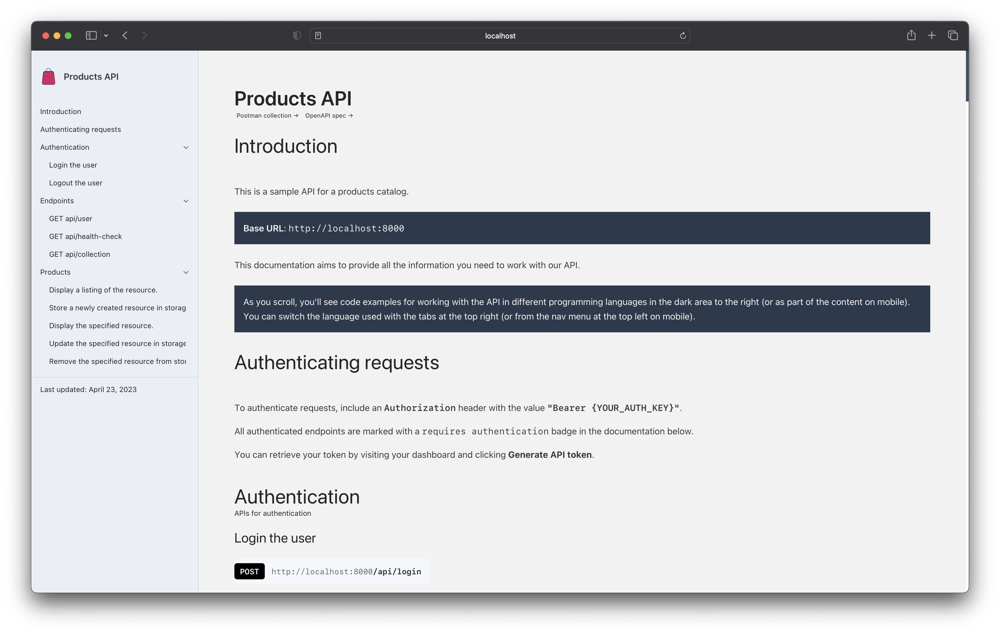

# Products Catalog API

[](https://github.com/alphaolomi/laravel-api-docs/actions/workflows/tests.yml)    [](https://codecov.io/github/alphaolomi/laravel-api-docs)

> This project demonstrates how to build a Laravel API with API documentation using Scribe.
> It serves as a backend for a simple Ecommerce sites like [Shop App](https://github.com/alphaolomi/shop-app).
> It is perfect for devs who want to learn how to build documented Laravel APIs from scratch.

In a nutchell, its a simple API to manage products to show case API documentation with Scribe.
Use this project as a learning resource or a starting point for your own Laravel API.
Skip the fake data API and start building your custom API with Laravel.



## Features

-   [x] Authentication with Bearer Token using [Sanctum](https://laravel.com/docs/9.x/sanctum)
-   [x] API Documentation with [Scribe](https://scribe.knuckles.wtf/laravel/getting-started)
-   [x] Product LCRUD API
-   [x] Cart LCRUD API
-   [x] Checkout API
-   [ ] API Versioning
-   [ ] Unit Testing using [PestPHP](https://pestphp.com/docs/)
-   [ ] Containerized with Docker[^1]

[^1]: For those who want to use Docker, Coming soon!

## Requirements

-   PHP >= 8.1
-   [Composer](https://getcomposer.org/)

## Installation

> Assuming you have Linux based terminal and PHP 8.1 installed

1. Clone the repository

```bash
git clone
```

2. Install dependencies

```bash
composer install
```

3. Create a copy of the .env file

```bash
cp .env.example .env
```

4. Generate an app encryption key

```bash
php artisan key:generate
```

5. Create an Sqlite database for the application

```bash
touch database/database.sqlite
```

6. Run the database migrations

```bash
php artisan migrate
```

7. Run the database seeders

```bash
php artisan db:seed
```

8. Run the application

```bash
php artisan serve
```

## API Documentation

The API documentation is generated using Scribe. To generate the documentation, run the following command:

```bash
php artisan scribe:generate
```

The documentation will be available at `/docs/index.html` in your browser.

## Testing

Project uses PestPHP for testing.


To run the tests, run the following command:

```bash
composer test
```

## Code coverage


## Authors

-   [Alpha Olomi](http://alphaolomi.com)
-   [All Contributors](../../contributors)

## Support us

If you find this project useful, please consider supporting by giving a star ⭐️ and sharing it with your friends on Social Media.

<!-- add Twitter and LinkedIn share buttons -->

## Support us

If you find this project useful, please consider supporting us! 🚀🌟

💫 Give us a star on GitHub: ⭐️ [Laravel API Docs](https://github.com/alphaolomi/laravel-api-docs)

🐦 Share it with your friends on Social Media: [Twitter](https://twitter.com/intent/tweet?text=%F0%9F%9A%80%20Exciting%20news%21%20%F0%9F%8E%89%20Discover%20the%20ultimate%20Laravel%20API%20Docs%20project%21%20%F0%9F%93%9A%F0%9F%94%A5%20Perfect%20for%20devs%2C%20this%20open-source%20project%20is%20a%20powerful%20template%20and%20learning%20resource%20for%20Laravel%20enthusiasts.%20%F0%9F%92%AA%E2%9D%A4%EF%B8%8F%20%23Laravel%20%23OpenSource%20%0Ahttps%3A%2F%2Fgithub.com%2Falphaolomi%2Flaravel-api-docs)

Your support is greatly appreciated! Thank you for being a part of this journey. 🙏

## License

The MIT License (MIT). Please see [License File](LICENSE.md) for more information.
